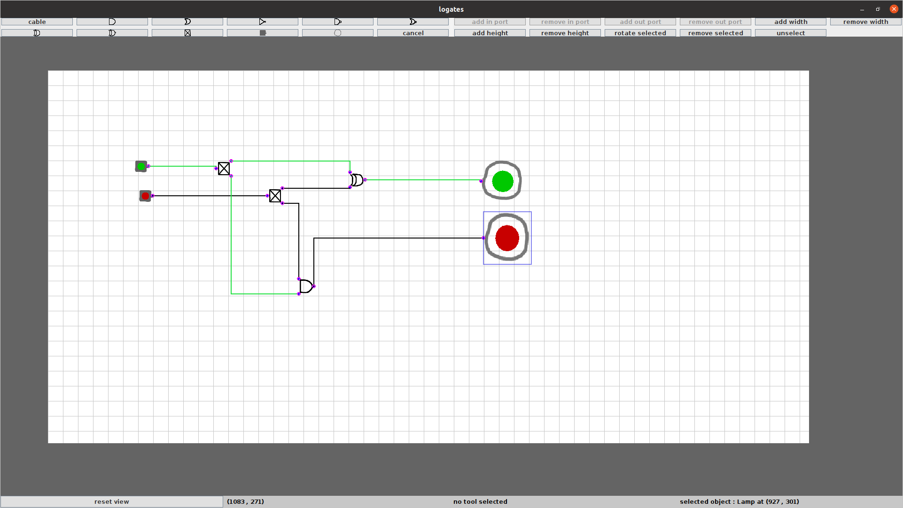

# Logates
Java desktop application for logic circuts simulation
## Table of contents
* [General info](#general-info)
* [Technologies](#technologies)
* [Setup](#setup)
* [Features](#features)

## General info
The project is java desktop application created with java swing library. Project features simulator of logic gates and cables circuts.
## Technology
Project is created with Java 13.

To run tests junit-4.9 library is needed.
## Setup
To compile project use:
```
$ git clone "https://github.com/maciejp12/logates.git"
$ cd logates
$ find src/ -name "*.java" -print | xargs javac -cp lib/junit-4.9.jar -d out/production/logates/
```
Run tests:
```
$ java -cp out/production/logates/:lib/junit-4.9.jar org.junit.runner.JUnitCore test.GateTest test.LogicCalculatorTest test.PortTest test.PositionTest
```
Run application:
```
$ java -cp out/production/logates/ logates.Main
```

## Features

#### Creating and selecting objects

   To create new scene object select tool on top panel
    and left click on the selected position in the
    draw panel. To cancel selected tool click cancel button.

   Available types of scene objects:
   * Cable (for connecting other components)
   * And logic gate
   * Or logic gate
   * Not logic gate
   * Nand logic gate
   * Nor logic gate
   * Xor logic gate
   * Nxor logic gate
   * Repeater (to multiply input state)
   * Button (inputs state from user)
   * Lamp (outputs state from source state)

   Currently selected tool type is displayed in the
   bottom panel.

   To select object left click on it on main panel. To unselect selected object left click anywhere on main
    panel where there is no other object or left click
    on other object to select it and unselect previously
    selected object. Selected object can also be unselected by clicking
    unselect button on top panel.

   Currently selected object is highlited in blue frame,
    and information of its type and position is displayed
    on bottom panel.

#### Moving objects
   To move object on main panel, first select it, then
    hold left click on its position and drag mouse to move
    it.

#### Connecting objects

   All objects are connected with each other via ports
    with cables. Cable state can be either active(green) or
    inactive(black).
    
   There are two types of ports:
   * Input port (displayed as pink circle)
   * Output port (displayed as blue dot)

   Each cable has one input port and one output port.

   To connect one object with another:</br>
        1.Create new cable object.</br>
        2.Select new cable input port</br>
        3. Move selected port near(max 5px gap) one of
           source object output ports to connect it</br>
        4. Select new cable output port</br>
        5. Move selected port near(max 5px gap) one of
           target object input ports to connect it.</br>

   Moving connected objects does not break connection.

   To disconnect cable from other object select cable
    port that is connected to that object and move it
    further than 5px from currently connected port.

   Objects like button can be toggled by right clicking
    on them.
#### Removing objects
   To remove an existing object on main panel, first
    select it and click remove selected button on top
    panel(or press key 'd').
#### Rotating and resizing objects

   All objects can be rotated and resized(excluding cables). To rotate an object first select it and click rotate selected
    button on top panel(or press key 'r').

   To resize an object first select it and click
    add/remove width/height buttons on top panel.
    Objects cannot be resized to be smaller than
    minimum size(default 16px width and 16px height).

   To add or remove input/output ports to objects,
    select object and click add/remove in/out port
    buttons in top panel. All objects have minimal
    and maximum number of possible input and output
    ports, and thet can not always be added or
    removed(ex. not gate can only have one input
    port).

   To move main panel hold right mouse click on position
    with no objects and drag mouse.To resize main panel hold left mouse click
    near (max 5px ga) one of its borders and drag
    mouse to resize. To move main panel to default position(top left
    corner) click reset view on the bottom panel.
    Main panel size remains unchanged.

   To show about page click about on bottom panel.


Example screenshot:



